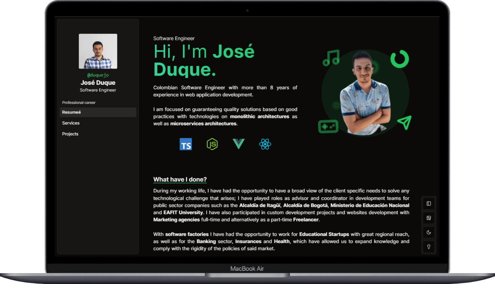
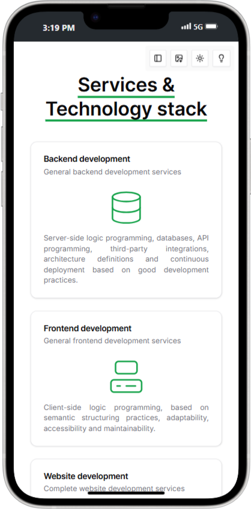

# José Duque Curriculum Vitae

<a href="https://nextjs.org"></a>
<a href="https://gitmoji.dev"></a>

**Site URL: [www.duquejo.com](https://www.duquejo.com/)**

Welcome to my GitHub repository dedicated to showcasing my professional journey! This repository serves as an interactive and dynamic Curriculum Vitae, providing an in-depth look at my skills, experiences, and projects.

Thank you for visiting, and I look forward to connecting with you!

## Table of Contents

- [Technologies & Tools](#technologies)
- [Installation](#installation)
- [Live Screenshots](#screenshots)
- [Support & Contributing](#contributing)

## Technologies

- Typescript
- React JS
- Next JS
- SWR (React hooks for data fetching)
- ShadcnUI
- Tailwind
- Negotiator (HTTP Content language)
- Vitest (Unit tests)
- React Testing library
- Playwright (Integration & e2e tests)
- Next intl (Internationalization)
- Eslint / Prettier (Code standards)
- Husky & Commitlint / Gitmoji (Commit standards)
- Vercel (Deployment & Statistics)

## Installation

Download the project directory and follow the next steps:

1. Copy the `.env.sample` file, rename it as `.env`, and complete the local environment variables for the Github connection and the site translation features.

```dotenv
 EVENT_GITHUB_URL="Github feed source"
 EVENT_GITHUB_SOURCE="Github token"
 PDF_EMAIL="PDF final email"
 SITE_URL="Website footer source url"
 PDF_FILENAME="PDF download filename"
 ALLOWED_ORIGINS="Comma separated allowed origins"
 NEXT_PUBLIC_ANALYTICS_ID="Google Analytics Identifier"
```

2. Install the packages using `yarn install`.
3. Run `yarn dev` for start the vite development environment or `yarn build` to start the production bundling package process.

## Screenshots

<div style="display: block; text-align: center;"> 
  
  
</div>

## Contributing

- Please contribute using [GitHub Flow](https://guides.github.com/introduction/flow/).
- In case you need to add a contribution request, create a branch, add commits, and [open a pull request](https://github.com/duquejo/vue-cv/compare/) following the [Gitmoji convention](https://gitmoji.dev/):

```bash
<intention> [scope?][:?] <message> # Ex: ":sparkles: feat(users): users management feature"
```

- **intention**: An emoji from the list.
- **scope**: An optional string that adds contextual information for the scope of the change.
- **message**: A brief explanation of the change.
